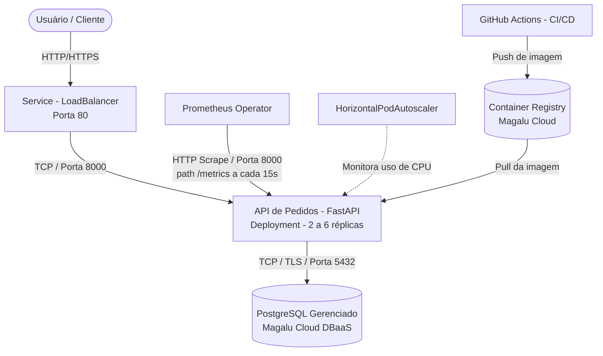

**Aluno:** Elbia Simone Buglio
**Repositório do Projeto:** https://github.com/Elbiabuglio/move-tech-cloud-application-comp-6-cloud-architecture-documentation

# Documentação de Arquitetura da Solução

## 1. Mapeamento de Recursos (Cluster & Cloud)

**Recursos no Cluster Kubernetes (Magalu Cloud):**
- **API de Pedidos** (`cloud-application`) — Deployment FastAPI, 2 a 6 réplicas, porta do container 8000
- **Service** (`cloud-application`) — tipo LoadBalancer, expõe a porta 80 externamente, roteando para 8000
- **HorizontalPodAutoscaler** (`cloud-application`) — escala por CPU (alvo 70% de utilização, min 2 / max 6 réplicas)
- **ServiceMonitor** (`cloud-application`) — integração com Prometheus Operator, coleta métricas em `/metrics` a cada 15s

**Serviços Externos / Gerenciados:**
- **Banco de Dados PostgreSQL Gerenciado** (Magalu Cloud DBaaS) — acessado via `DATABASE_URL` injetada por Secret (`db-secret`)
- **Magalu Cloud Container Registry (MCR)** — armazena as imagens Docker publicadas pelo pipeline
- **GitHub Actions (CI/CD)** — pipeline `deploy.yml`: testa (pytest) → builda a imagem → publica no registry → aplica os manifests via `kubectl`

## 2. Diagrama C2 (Nível de Containers)

## 3. Estilo Arquitetural e RNFs

**Estilo Arquitetural:** Monolito Modular em Camadas, com implantação Cloud-Native em contêineres (Kubernetes), escalonamento horizontal automático via HPA e observabilidade integrada via Prometheus.

- **Disponibilidade Alvo (SLA):** 99.5%
- **Latência P95:** ≤ 500 ms
- **Vazão Alvo (RPS):** compatível com 20 VUs simultâneos (padrão do teste de carga k6), escalável via HPA até 6 réplicas
- **Teto de Custo (FinOps):** R$ 150,00/mês (estimativa de referência para a operação da solução)

## 4. Análise de Trade-offs e Próximos Passos

### Trade-offs das Decisões Tomadas
- **Custo:** optar por serviços gerenciados (banco de dados, LoadBalancer) reduz esforço operacional, mas tem custo direto maior que alternativas self-hosted dentro do cluster. O componente de maior peso no custo observado foi o próprio cluster Kubernetes (control plane e nós).
- **Escalabilidade:** o HPA permite escalonamento automático de 2 a 6 réplicas por CPU, cobrindo picos de demanda sem intervenção manual — porém a granularidade é de toda a API (monolito), não de partes específicas do sistema.
- **Disponibilidade:** o mínimo de 2 réplicas garante tolerância a falha de 1 pod, mas a arquitetura ainda depende de uma única região/zona e de um único banco de dados gerenciado, sem redundância multi-zona configurada.

### Pontos de Melhoria e Próximos Passos
- Avaliar a adoção de um Ingress Controller caso o número de serviços expostos cresça, reduzindo custo de múltiplos LoadBalancers.
- Investigar réplica de leitura (read replica) do banco de dados para melhorar disponibilidade e distribuir carga de consultas.
- Configurar alertas de custo (budget alerts) na Magalu Cloud para acompanhamento proativo do FinOps.
- Avaliar necessidade de segmentação em microsserviços caso o domínio de negócio (pedidos, itens, pagamentos) cresça em complexidade.